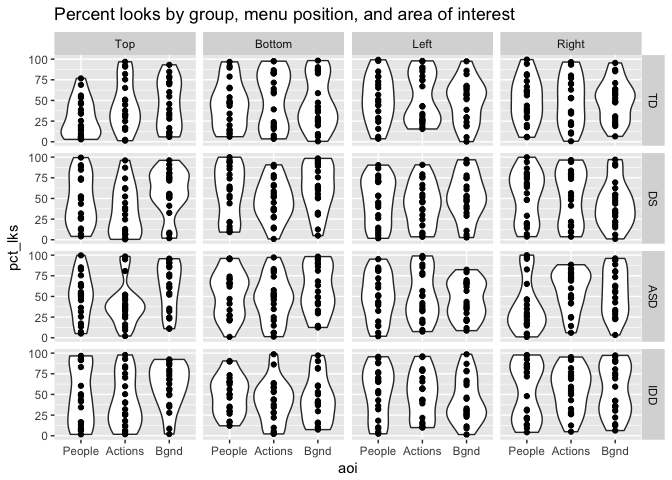
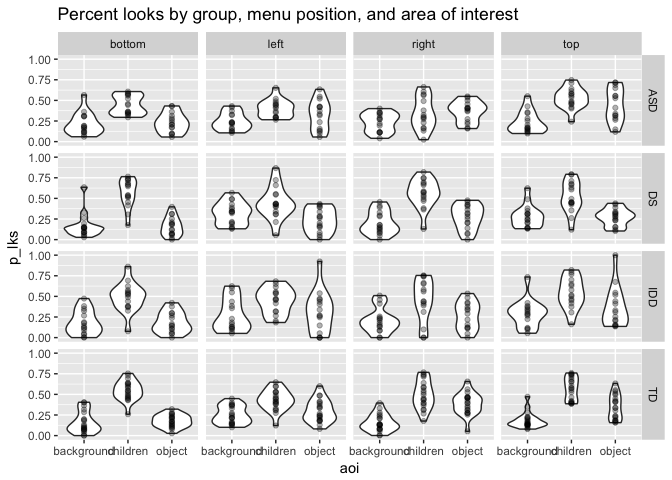

demo-plot
================
Rick Gilmore
2017-12-19 06:04:44

Create random test data file
----------------------------

``` r
n_subs <- 20
dx_groups <- c("TD", "DS", "ASD", "IDD")
menu_pos <- c("Top", "Bottom", "Left", "Right")
aois <- c("People", "Actions", "Bgnd")

# Make data frame
df <- expand.grid(sub_id = 1:20,
                 dx = dx_groups,
                 menu = menu_pos,
                 aoi = aois)

# Generate random values for pct_lks, could specify more if desired
df$pct_lks <- runif(dim(df)[1], 0, 100)
```

Create test plot
----------------

``` r
p <- df %>%
  ggplot(aes(aoi, pct_lks)) +
  facet_grid(dx ~ menu) +
  geom_violin() +
  geom_point() +
  ggtitle("Percent looks by group, menu position, and area of interest")
p
```



Import Tara's data
------------------

``` r
library(readxl)
library(stringr)
fn <- "data/S by S data_percent time in VSD_by bar location.xlsx"

# Manual inspection shows that Dx is in separate tabs
# that the menu position is in row 1 and the aoi labels are
# in columns B, C, D and E, F, G and H, I, J, and K, L, M

(sheets <- excel_sheets(fn))
```

    ## [1] "TD"  "ASD" "DS"  "IDD"

``` r
s1 <- read_excel(fn, sheet = sheets[1], range = "A2:M22")
s1g <- gather(s1, key = aoi, value = pct_lks, children, object, background, children__1, object__1, background__1, children__2, object__2, background__2, children__3, object__3, background__3)

tidy_vsd <- function(sh=1, fn = "data/S by S data_percent time in VSD_by bar location.xlsx") {
  require(readxl)
  require(stringr)
  t <- read_excel(fn, sheet = sh)
  # Skip 2nd row, but include rest
  s <- read_excel(fn, sheet = sh, range = paste0("A2:M", dim(t)[1]+1))
  sg <- gather(s, key = aoi, value = p_lks, children, object, background, children__1, object__1, background__1, children__2, object__2, background__2, children__3, object__3, background__3)
  
  sg$dx <- excel_sheets(fn)[sh]
  sg$aoi <- str_replace(sg$aoi, "[_0-9]+", "")
  sg$menu <- rep(c("top", "bottom", "left", "right"), each=dim(s)[1])
  sg
}

vsd_list <- lapply(1:4, tidy_vsd)
vsd <- Reduce(function(x, y) merge(x, y, all = TRUE), vsd_list)
```

Sample plot
-----------

``` r
p_vsd <- vsd %>% 
  ggplot(aes(aoi, p_lks)) +
  facet_grid(dx ~ menu) +
  geom_violin() +
  geom_point(alpha = .3) +
  ggtitle("Percent looks by group, menu position, and area of interest")
 
p_vsd 
```


